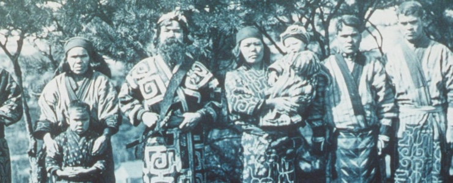
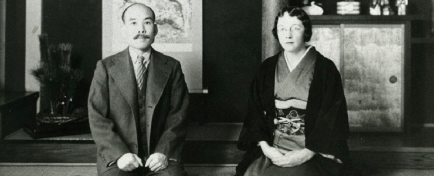
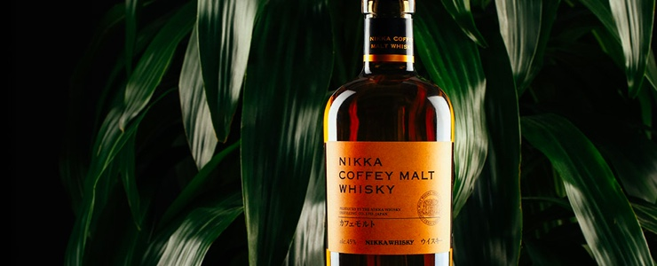
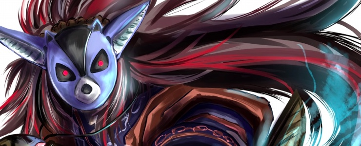
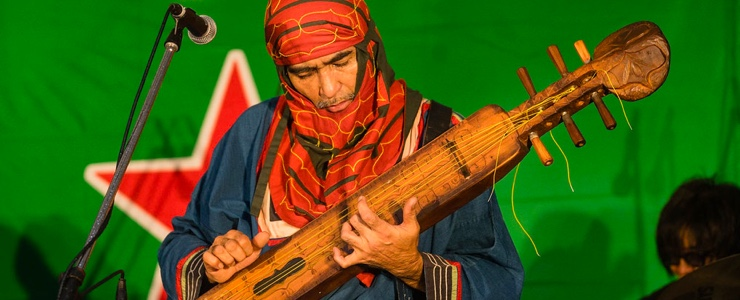

Change is never convenient. It seems to come at the most inopportune times. It also brings its partner to ensure the change is followed through, transition. It doesn’t usually seem like it at the time but transition is the connective tissue of your journey in life. They hold a very specific place in your memory and remind you that the only thing permanent in life is change. There is a spectrum of human responses during the transition phase of change. For today’s episode, the responses to transition weave a fascinating story unique to the land of Hokkaido.

Hokkaido is the second largest island of Japan and the northernmost prefecture. It’s about the same size as the state of Maine. 26 miles north of Hokkaido is Sakhalin, Russia. It was originally named Ezochi but was changed during the Meiji Era around the end of the 19th Century. 

Question: so what makes Hokkaido so different from the rest of Japan?

Hokkaido has a unique history that diverges from common preconceived ideas of Japan being one homogenous society. It was initially inhabited by people who did not consider themselves Japanese for thousands of years. The Ainu (pronounced EYE-NEW) are the indigenous people of Hokkaido that live in three different regions: Hokkaido, Sakahalin to the North and The Kuril Islands to the East.

The Ainu look to have more in common with Native Americans and Eskimos than that of their southern neighbors. This goes in both in physical and cultural resemblance. Starting in 700 AD and lasting for half a millennium, the Ainu conducted trade with Dewa Province of Japan. During the Muromachi Period, the Japanese created a settlement in Southern Japan and conflicts arose between the Japanese and Ainu.The conflicts turned into warfare ending with the death of an Ainu leader and the rise of a mainland family to have exclusive trading rights in Hokkaido. This began the transition of the Japanese feudal state having more influence in the region.

Question: what type of changes were brought to the Ainu during this period?

The transition period was accelerated at the end of 19th Century, the change was enforced when the Japanese feared Russia would claim Hokkaido for themselves. They brought in the help of the United States to introduce agriculture, mining and Christianity similar to what was done with Western Expansion against a native people in America. The efforts were achieved its goals, the population grew from 50,000 to 250,000 during that period, almost entirely comprised of people from mainland Japan. The Japanese annexed Okinawa at the same time too. During WWII, Hokkaido was almost invaded by Russia but was called off by the United States.

Question: is there anything that people may not have known Hokkaido is famous for?

Hokkaido has shown up in popular culture:
Sapporo beer. Has a similar story of its founder leaving for Germany to learn brew making and bringing it back to Hokkaido.
The female character Nakoruru from the popular 90s fighting game from SNK, Samurai Shodown was an Ainu from Hokkaido
An anime named Golden Kamuy, takes place in Hokkaido during the Meiji period. Special focus was taken to portray the Ainu people with dignity and respect.
The Emishi people from the movie Princess Mononoke. They were referred to as The Hairy People.
In the video game Okami, there is a wintery northern island named Kamui which is the reference to the name for gods in Ainu culture.

## The Drink Spirit: Nikka Coffey Grain Whisky
### The Story of Masataka and Rita Taketsuru

The next story is about the end result of managing transition and that change in a bottle. A young man travels halfway across the world to learn of an alcohol that is foreign to his own native land. In the summer after the conclusion of World War I, Masataka Taketsuru, the son of a chemical engineer and sake maker, travels from his homeland of Hiroshima to the University of Glasgow in Scotland to study Organic Chemistry. His purpose of going was to unlock the secret of the one type of European alcohol that had not yet been cracked, whisky. During that same time, a Scottish girl named Jessie Roberta Cowan lost her fiance during World War I and her father to a heart attack. Finances became tight in the Cowan house and Rita’s mother decided to allow someone to stay with them and pay rent. The person was Masastaka. While staying, he and Rita grew fond of one another and they married in 1920. Within a few months, Masataka asked Rita to move back with him to Japan so he could begin creating Scotch in his homeland. The transition period for them both began when Rita agreed to move back. 

Question: so what was the change in life like for Rita and Masataka when they moved to Japan?

Upon returning, Japan was hit with a recession which made the transition period trying for Masataka. Companies were looking to make a quick profit and were not interested in the long patient process of making a true batch of Scotch. After having fallouts and demotions with Japanese companies that didn’t agree with his vision, Masataka chose to create his own distillery. 

Question: where did he get the money to start his own distillery?

He would not have been able to accomplish this without the help of his wife Rita. She was teaching English to the wife of the founder of a successful securities company. Upon hearing of the stories of Masataka’s journey to Scotland and his apprenticeships while there, Shotaro Kaga and two other investors decided to back Masataka’s plans for his own distillery. Masataka chose Yoichi, Hokkaido because the location reminded him very much of the geography of the distilleries he visited in the Highlands in Scotland. He also chose the Coffey Still for the benefit of being run continuously unlike the  traditional Pot Still that has to be charged between batches.

Question: so with Japan switching allegiance from WWI to WWII, how did that impact Rita and Masataka?

The period of change became both difficult and advantageous after the Pearl Harbor attack. When Japan attacked the United States, neighbors and even the government became suspicious of Rita being a spy. She became isolated from the community during this time but the Japanese government did allow her to stay in Yoichi. Alternatively, the war was a blessing in disguise for Masataka and the whisky business. The Japanese Navy were known as huge connoisseurs of Scotch Whisky. For the same reason that Rita became distrusted, the Imperial Navy was forced to look inward to fill the demand. There alone was Dai Nihon Kaju, now known as NIkka Whisky. The company was classified as a War Industry. Further rectification for Rita came in 1998 when a Museum was built for her and her husband. She is now known as “The Mother of Japanese Whisky” and also has her own fan club in Japan that journey to the museum in her honor.

### Nikka Coffey Grain Whisky

The Scots spell it whisky and the Irish spell it whiskey, with an extra 'e'. This difference in the spelling comes from the translations of the word from the Scottish and Irish Gaelic forms. Whiskey with the extra 'e' is also used when referring to American whiskies. Japanese whisky is very similar to Scotch in process, taste, and texture. 

Nikka Coffey Grain is predominantly made from corn and a barley malt, then it is distilled in a Coffey Still. 

Question: how is a Coffey Still different from a traditional Pot Still?

The Coffey Still is the world’s first patented continuous still invented by Mr. Aeneas Coffey in 1830. Also referred to as a Column still, it is of the variety consisting of two columns for processing. Masataka Taketsuru valued the feature of this type of still, which retains the flavors of ingredients and also creates a distinctive texture.
The flavor of the Coffey Grain offers a complex, sweet and mellow flavor. Some say this expression will help you re-discover the beauty of a grain whisky. 
Nose: Bourbon-like vanilla and corn notes with an herbal hint of chamomile.
Palate: Sweet, fruity flavours of melon, grapefruit and thick syrup, balanced by crunchy biscuits and fresh vanilla.
Finish: The corn notes, sweet and vibrant, last on the finish.
Overall: Fans of grain whisky should be pretty happy with this, as well as bourbon lovers.

## The Supernatural Spirit: Okikurmi and the Kamuy

The Ainu people are traditionally animists, they believe that all places, objects and beings have some sort of spiritual essence to them. These persons, places or things appear in Ainu mythology with the name Kamuy. The stories of the Kamuy are passed down for generations through oral traditions or rituals called Yukar. The rituals are performed by men and women in a chant-like fashion. These stories are long epic sagas of oral literature that tell tales of The Land of the Gods (Kamuy Mosir) and The Land of the Humans (Ainu Mosir). By the way Ainu means “human.” The stories fall into two categories:
Kamuy Yukar: first hand account when a Kamuy tells a tale about themselves. Think the chapters in “A Song of Ice and Fire” by George R. R. Martin
Yukar: tales about human heroes

There are various interesting Kamuy that are featured in the Yukar that provide insight into how the Ainu handled some aspects of transitioning through changes in life. There is Apasam Kamuy, the god of The Threshold. They are called upon for protection when someone is going through a major change. Apasam is depicted as a male and female couple or as a dual entity. The dual nature allows this god to perceive both sides of a transition to better guard a person during a change. They are called upon for women in birth, travelers on a long journey and protection from outside cultures. Another of the most important Kamuy is Kamuy-huci. She is the keeper of the gateway between the world of humans and the world of the Kamuy. She’s called the Kamuy of the hearth in which it’s believed the hearth in the house must be kept clean. The reason for a pure hearth is because it’s the place where the humans after death would remain to transition to a new body when the time is right.

The best depiction of Ainu’s perspective on handling transition and change is not a full Kamuy but yet a demigod name Okikurmi. This Ainu Hercules is the embodiment of life and hope in the Ainu people. He wears the clothing of a shaman warrior. Okikurmi wields a spear made of mugwort and is cloaked below the waist in some of the purifying flames of the fire goddess Fuchi. His upper body was protected by a cloak of elm-bark provided by the vegetation god Shiramba.

Oki is believed to have descended from the Land of the Kamuy to the Ainu people. Upon his arrival, Okikurmi taught the Ainu how to make fire, how to hunt & fish and how to survive. He is widely known to be the guardian of the Ainu. In some stories of Ainu creation, it is Okikurmi and his wife Turesh who have a son that is considered the first Ainu.

What makes Okikurmi so interesting is that he is on both the giving and receiving end of change in Ainu tales. In the stories of being an agent of change, he is directly interacting with Kamuy even though they are considered divine beings. Good and evil Kamuy exist and Okikurmi has the strength and stamina to fight back against the Kamuy when needed. He also uses his wisdom and knowledge to be a fair judge of when kindness is correct instead of trickery or violence. These tales are definitely used as what we think of with parables to create tenets on how to live your own life. It greatly resembles The Serenity Prayer:

God grant me the serenity to accept the things I cannot change,
Courage to change the things I can,
And wisdom to know the difference.

Okikurmi is often portrayed in tales as a “Gallant”  character opposite a “Goofus” god named Samai-Unkar. Samai is usually careless or forgetful while Oki always does the right thing. Samai is usually killed for is incompetence in most of the tales and Okikurmi has to avenge his death.

The best story of Okikurmi displaying both sides of change is his lengthy conflict with the wind goddess Pikatakamuy.

A significant time has passed since Okikurmi has descended on the village of the Ainu. Things are going great for the Ainu people. Hunting and fishing trips bring back bountiful amounts for the whole village to be nourished. The children are happy, their culture and beliefs are as strong as they could ever be. Then it begins to rain...At first it started as thunderstorms but waves from the sea make their way to shore and crash upon the village for six days. The entire village is destroyed except for Okikurmi’s house. No lives are lost but there will be much starting over from scratch. Oki uses all the possible useful magical tools in his house and in time he helps along with the Ainu people to build the village back to a prosperous state.

The good times are back again but they do not last long. The favor of good luck is not on their side and the disaster that next comes through the village is worse than before. A furious almost tornado like windstorm crashes into the village and again stays for six days. The storm destroys not only the entire village but kills most of the Ainu people in the village. When the storm stops, the loss of both life and community is incalculable. Oki also realizes this is more than dumb bad luck, upon looking off at the mountains, he catches a woman flying away wearing a gown capable of hurling storms and robes capable of stirring winds.

Question: who is the woman that flew off from the mountains?

He realizes this is the work of the wind goddess Pikatakamuy. He feels compelled to action to pursue Pikata but first he prays to Apasam Kamuy, the god of the threshold to gain as much knowledge of where he is now and where the outcome may take him. The final god he calls upon is Kamuy-huci. With his house still standing, he ensures the last hearth of the village is clean so that Huci can take the spirits of the Ainu lost in the storm to a place to transition to another form if it is the gods will. Now he grabs his spear, magical fan, his cloak of Fire & cloak of Elm armor and heads to the land of the Kamuy to seek justice from Pikatakamuy and avenge the fallen Ainu.

Question: so why did Pikatakamuy attack the Ainu Village

So as the legend goes this is all over bitterness and distraction. The one thing that Pikata loves more than dancing and bringing powerful storms, is embroidering. Anyone who can interrupt her embroidering will get the ire of this goddess. The Ainu village was so prosperous during the time of Okikurmi that the songs they would sing would reach the land of the Kamuy. And these songs reached Pikata’s house and distracted her so much from her embroidering, she just had enough.

She put on the robes and gowns she made herself and flew to the mountain and began her dance. The wind came from the tips of her fingers and the sleeves of her robes and traveled to the sea to create waves that crashed on the Ainu village. She thought that would be the end but not soon after that the songs returned. And she was now furious. She created even stronger storms so much so that even the tree gods wailed in pain as they were uprooted. She thought that this time would definitely be the end of the singing and headed back up into the sky. Little did she know that Oki caught a glance of her and was now on his way to even up the score. Now back at her house, a young Ainu man arrives at her doofront and the final conflict is set to begin, the future of the Ainu people hanging in the balance.

Question: So how did the fight begin?

Okikurmi initiates the battle by “thanking” Pikatakamuy for her dances but he then replies with, “Now allow me to show you the dance of the Ainu!” Now from the tips of Okikurmi’s fingers to the sleeves of his robe, a ferocious wind begins to blow, knocking down things in Pikatakamuy’s house and causing the fire to rise in the hearth/fireplace. The wind was soo strong, the only foundation left to the house was framing.

Oki then pulls out his magical fan, one side a picture of cold winter mountains, the other side a picture of a raging red hot sun. He turns to the winter side of the fan tells Pikata that the Ainu dance is not finished and begins to wave at Pikata. Her body begins to feel like she is freezing to death. Snow and hail began to shower down all around her. Pieces of ice tore off her robes and gowns and covered covered her in bruises. Oki then tells Pikata that the dance of the Ainu is not done. He flips the fan to the other side where upon fanning, the mighty force of the red sun is set ablaze upon the wind goddess. The rays scorched and burned Pikata’s skin while also blinding her and bringing her to her knees. She is defeated in a heap on the ground and Oki walks up close.

Question: So what happens next?

Oki reaches and takes out his spear that he’s used numerous times to slay many gods. But in the moment he has a change of heart. He returns the spear to his back. Oki approaches the wind goddess for a reason why she attacked the Ainu village claiming many lives. He also shares that he was planning on killing her but he had changed his mind because Pikatakamuy was the goddess of wind and is necessary. After giving a mandate of no more strong winds to Pikata, Oki shows kindness by healing her bruises, mending her robes and fixing her house with each wave of his magical fan. Oki returns back to the Ainu village with the promise of only calm winds from here on out. Kamuy-Huci has restored most of the villagers from the storm. Okikurmi goes back to helping the Ainu rebuild what was lost and vows to remain protecting the village. I’m sure that the process of staying put after a major setback, facing an adversary head on and then showing mercy in victory is the path that was chosen by the Ainu many times during their transition period with the mainland of Japan.

## The Lyrics: Utarhythm - Oki Dub Ainu Band

Oki Kano was born in 1957 in Kanagawa Prefecture, next to Tokyo. He Lived a traditional Japanese life with a mother and father. His nickname at school growing up was Ainu but he didn't pay it any mind. He earned a degree in crafts at  Tokyo University of Fine Arts and Music. Even with a degree earned, Oki was still searching for something. In 1987 he moved to New York City to, "be a nobody".

He worked as a special effects artist on film productions in New York City. No prominent opportunities arose and he spends the next 5 years in New York before returning to Japan still searching to find himself.  He changed careers upon his return, switching from special effects to an art director. Even the change in careers still left Oki searching for himself.

Two pivotal events change his life. He learns that who he thought was his father wasn't his biological father. His biological father separated with his mother when he was 4 or 5.

Question: Who was his real father? Why was it kept a secret.

His father was Bikki Sunazawa. Prominent Ainu artist, sculptor & painter. Helped make Ainu culture known to the world. Designed the flag of the Ainu people. He was outspoken about the tenuous relationship between the Ainu and the Japanese during a time when practicing Ainu culture and traditions were outlawed. I think it’s fair to say that conformity is valued above all in Japanese culture, so revealing the true hertiage of a people who’ve faced centuries of goverment sanctioned discrimination would have put her son at risk. Now the nickname that children gave to Oki while growing up now made sense.

Question: Did he ever get a chance to meet his father?
I’m not sure if he did or not, within a few years of him discovering his Ainu heritage, Bikki passed away from bone marrow cancer in Sapporo in 1989.

The second life-changing event was when he was given the musical instrument of his ancestors, The Tonkori.

Question: So what is a Tonkori?

A tonkori is a 5 stringed instrument created by the Ainu of Sakhalin. It looks like a wicked combination of a guitar, canoe and sword. It’s intricately carved out of a Jezo spruce Evergreen tree and the strings are tuned to alternate between high and low notes. It’s held across the chest and both hands are used to pluck opposite sides. The best way to describe the tonkori is “having a tone quality that pierces the body, and melodies that repeat as if a prayer were being offered.” The purpose of the instrument's trance like intros is to drive out nearby demons and evil spirits before a song is played. The Ainu people believe that every tool of theirs houses a spirit and the Tonkori is no different. A glass bead is placed in a hole in the trunk of every Tonkori to represent the spirit of the instrument.

Question: Why has no one heard of a Tonkori?

The instrument almost goes into extinction, but two paths of transition meet and form a new transformational route that benefits both. Oki moves to Hokkaido and teaches himself how to both play having never played an instrument before. Iko also learns how to craft the Tonkori. He then blends the traditional music of the Ainu with his own worldly influences...Reggae, Dub, Afrobeat, Funk and Electronic music. Oki is now the most prominent performer of the Tonkori in the world. 

In addition to bringing the instrument to world recognition, Oki also works with international organizations to help promote Ainu culture and help with indigenous communities around the world.

### The Songs

Utarhythm: The first thing you hear on the album is dueling Tonokoris and chanting. Then it blends in the influences of other cultures like the unmistakable synth transitions and bass of reggae. This songs sounds like the Yukar story of Okikurmi descending from the land of Kamuy to the Ainu village for the first time.

City of Aleppo: Again leading with the Tonkori, ending the intro with a jump from the shores of Hokkaido and into a nice syncopated rhythm that sound fresh off the coast of Jamaica. The Tonkori solo is beastly over the syncopated bass that then transitions electro pianos over top. Wonder if this song is a tribute to the Syrian city of Aleppo.

Kenkeyo: This song shows off the dynamic sonic possibilities of the Tonkori best on the album. You think the song will stay like it does at the beginning sounding like a more traditional East folk music, but they introduce electro sounding transitions then mixed with what sound like Pacific Islander chants. When you think that is enough then the big turn appears. The music fades and the Tonkori comes back in a “trance-like” almost a breathing, vibrating shaman driving off spirits. It then goes to overdrive by bringing in traditional kick drum and bass that reaches a crescendo. The drums then drop out for the pinnacle of the album. When the drums come back, it is with the Kamuy Yukar of Clyde Stubblefield. One of the most organic syntheses of different cultures in one piece of music. This now sounds like a Roots song with the Tonkori going dumb on the beat. I can already hear Black Thought coming on and burning the instrumental down.

Arahuy: Here the chanting sets the tone for the shape of the song. What proceeds the chanting is a cool collection of cool elctro funk. Dope sounding song.

Ankisma Kaa Ka: The song allows for a cool dueling of string instruments. The Tonkori patterns on the solos sound to be the most technically complex of the album. The low sound chanting rolls in smoothly with the Tonkori solo and bass rhythms.

Utari Opunparewa: This sounds like the most accurate representation of what the beginning of a contemporary Kamuy Yukar would sound like. The organ and the chanting sound like the sonic waves would reach beyond the mountains and into the land of the Kamuy to invite themselves down for a story to share with the community. The vocal cadence set a dope sounding call and response.

Kamuy Sinta: Sinta doesn’t have a direct translation in Japanese the closest I could find was Filipino meaning, “love”. That would be fitting for this song to be named for the god of love. This sounds like the soundtrack of a psychedelic, peace-loving chill god.