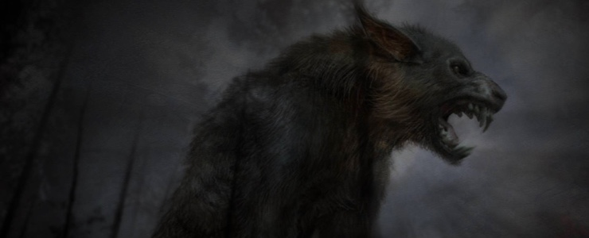

Middle Tennessee is the central Grand Division in the state of Tennessee. It’s as far east as the Cumberland Plateau (line between east and central time zone) and as far west as the Tennessee River. It contains 3 subregions: Upper Middle, South Central and Upper Cumberland.

## The Drink Spirit: Uncle Nearest

Nathan "Nearest" Green (c.1820), was an African-American head stiller, commonly referred to now as a master distiller.  Born into slavery and emancipated after the Civil War, he is known as the master distiller who taught distilling techniques to Jack Daniel, founder of the Jack Daniel Tennessee whiskey distillery. Sometime in the 1850s, when Jack Daniel was a boy, he went to work for Dan Call, a preacher, grocer, and distiller.  According to company lore, the preacher was a busy man, and when he saw promise in young Jack, he taught him how to run his whiskey still.  

In June 2016, The New York Times published a story identifying Daniel's true teacher as Nearest Green, one of Call’s former slaves. The newspaper said that historians and locals have known the Green story for decades, even as the distillery officially ignored it.  Green was hired by Daniel as the first master distiller for Jack Daniel Distillery, and he was the first African-American master distiller on record in the United States.

## The Supernatural Spirit: Werewolf of Dickson County

For those that live in Tennessee, you may know there is a place called Werewolf Springs located in Dickson County, where as legend has it, lives a werewolf.  The area referred to as Werewolf Springs is also known as Hall Springs, which presently can be accessed through Montgomery Bell State Park’s 11-mile overnight hiking trail.  Eerily enough, the overnight trail passes through a cemetery before reaching Hall Springs.  Residents grew up hearing tales of the county’s werewolf and noted the story is one of Dickson’s best-known legends. 

The legends and stories say that in the 1860s a circus train derailed, spilling its cargo.  One of the things the circus train was carrying was the “Wolf-men of Borneo” – two supposed “wolf-men” (or werewolves) who were part of the circus attraction.  They say that when cleaning up the wreck, the two wolf-men were never found, dead or alive after the train crash.

Sightings of a creature in the forest surrounding the crash continued for a few years after the train crash.  On various occasions travelers in the area were followed, chased, or disappeared.  Reported sightings include a huge creature totally covered in hair, and other reports included the sounds of howling.  A couple of years after the train wreck, a local landowner and his hired hand set out from a farm on the owner’s homestead. They were making their way along a country road in the location where a highway runs southwest of the park, when something spooked their horses in the vicinity of Werewolf Springs, and they saw a wild creature that walked upright like a man watching them from the woods. The thing seemed to be hunting and the hired man loosened the reins and gave the horses their head.  Though the team was at a full gallop, they still couldn’t shake the creature.  The men jumped from the wagon and ran into the woods in different directions. The wolf-man went after the hired hand and shortly thereafter, the landowner heard bloodcurdling screams. He didn’t stop until he reached the home of a nearby farmer. He and other men on horseback returned to the location, where they found the horses and wagon, but there was no sign of the hired hand. He was never seen or heard from again.

Shortly thereafter, a posse was organized to hunt down and kill the beast – or beasts. The men headed to a clearing near the spring where large bones were often discovered, believing the location was in close proximity to the wolf-man’s den. They tethered a goat and divided into pairs to watch. It was dark by the time a hairy monster stealthily entered the clearing and went for the goat. The men commenced firing at the creature, after which they grabbed their lanterns and checked to see if their bullets had found their mark. Not only had the beast and goat vanished, so had two members of the posse.

A big-game hunter was the next to attempt to slay the wolf man and from a cabin near Werewolf Springs. All was quiet the first two nights, but on the third, the hunter heard howls in the distance and took aim from a window at what appeared to be the werewolf. He fired, but the gunshot provoked the creature and the beast broke through the cabin door. By this time, the hunter had climbed into the rafters and began firing at the monster from above. Again, the shots did nothing more than antagonize the brute that growled, swiped and clawed at the hunter. Realizing he had just two shots left, the hunter was certain he was about to meet his maker when the sun rose and the creature fled into the woods.  To the present day people still hear screams and howls coming from the woods at night.

A more recent account of the creature states, “I have lived in Burns for 20 years. When I was young my brother and I stayed in the woods. One day we found a pit in the ground that looked like some kind of cavern. My dad had killed a big hog the day before only to discover there was something wrong with it. He needed a place to dump it so we told him about the cavern. The next day we dumped the 150 pound hog in hole. The next day my brother and I went to check on it. There was no trace of the hog to be found. No bones, hair or even blood. The hog had seemed to of vanished. There have also been reports of people seeing and hearing something odd. Some have claimed to see a very large human like creature covered in white hair and also a blood wrenching scream that sounds like a woman screaming at the top o her lungs. Some say the scream is so loud it almost stuns you.”

An interesting question was posed stating, “Is it pure coincidence that the Werewolf is the symbol of the Dickson Scottish clan where all Dicksons originate from. Some speculate it was because the werewolf represented the Dicksons as mercenaries, but I’ve also come across a supposed journal entry of a Dickson Clan member stating that they chose the beast as their symbol because they encountered it and it traveled with them through the Highlands.”  Stories have been heard of werewolves lurking in the Moors of the Scottish Highlands.  Could the Tennessee creature be a descendant of these beings?

## The Remix: Tennessee Gold

2 oz. Uncle Nearest Premium Aged Whiskey
¾ oz. Fresh Lemon Juice
¾ oz. Honey Syrup*
Add all ingredients into a shaker tin with ice and shake well for ten seconds. Strain into a rocks glass over ice.
*Honey Syrup: Heat equal amounts honey and water in a saucepan. Stir until combined.

## The Lyrics: A Full Moon on Main Street - Freddie Waters

Freddie Waters began his musical career in Nashville Tennessee in the mid 1960s as lead singer for a vocal group called the Hytones. They were featured regulars on a legendary television show called "The Night Train" (the earliest known footage of Jimi Hendrix was also on this show). Through this exposure they were discovered by producer/arranger Robert Holmes. He produced a couple of obscure 45s (on a small Excello subsidiary) for them and then was hired as arranger for Ted Jarrett's Ref-O-Ree label. Mr. Holmes brought Freddie Waters and Eddie Frierson (another member of the Hytones) along with him to the new label.

Freddie & Eddie recorded a couple of duets together in a Sam & Dave style but soon Freddie was out on his own as the label's most visible artist, logging several regional hits. As some records started to get action in several major southern markets, it came to the attention of Curtis Mayfield who leased the master and re-released it on his Curtom label. The record did quite well in the south. This success, in turn, lead to interest from Stax Records in Memphis, and it looked like Freddie was getting hot.

Things began to look up as Freddie was brought into the fold and landed a contract with October Records, a new (and sadly short-lived) Nashville soul label. The first single release "I'm Afraid To Let You Into My Life" was a regional hit and was soon followed by an album "Just Enough To Get Me Cool". Freddie was still bubbling just below the surface, unable to break through to the top.  As the 1980s dawned, Freddie Waters returned to what he did best, concentrating on live performing. He hooked up with old pal Jimmy Church and his revue show, singing the old songs to adoring crowds throughout the mid south.  Sadly, Freddie passed away in 2000, but he was very excited that these great records would get a second chance. Some felt that with a couple of good breaks; Freddie Waters would have been a household word in the soul music world. 
